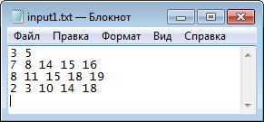
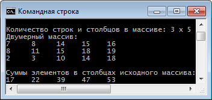
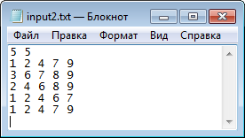
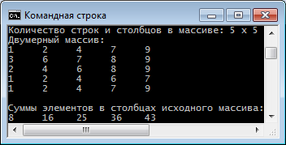
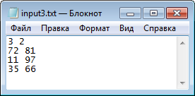
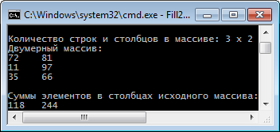

# Test Cases

## № 1

## № 2

## № 3

# Links

- [Read numbers from a text file in C# - Stack Overflow](https://stackoverflow.com/a/1968640/2289640)
- [c# - Multidimensional Array [][] vs [,] - Stack Overflow](https://stackoverflow.com/a/12567550/2289640)
- [c# - Format Strings in Console.WriteLine method - Stack Overflow](https://stackoverflow.com/a/4223849/2289640)
