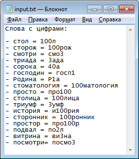
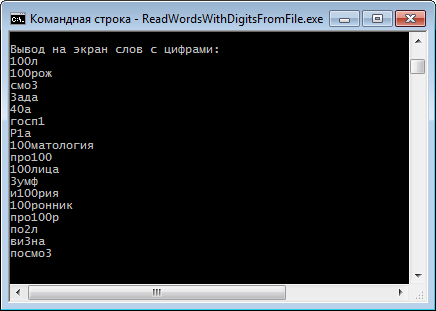

# Test

# Links

- [c# - Reading a text file word by word - Stack Overflow](https://stackoverflow.com/a/9740611/2289640)
- [c# - Check if a string has at least one number in it using LINQ - Stack Overflow](https://stackoverflow.com/a/1540633/2289640)
- [Read txt files (in unicode and utf8) by means of C# - Stack Overflow](https://stackoverflow.com/questions/18871603/read-txt-files-in-unicode-and-utf8-by-means-of-c-sharp)
- [Ответы@Mail.Ru: Какие еще есть слова с цифрами?](https://otvet.mail.ru/question/48777578)
